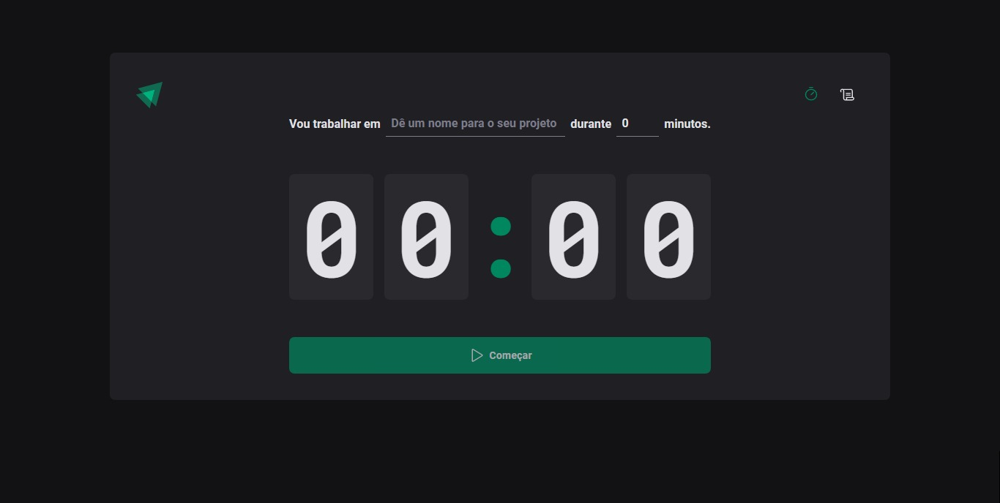
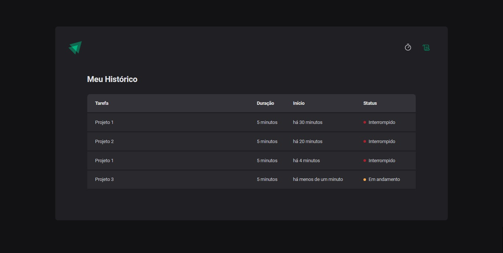

<h1 align="center"> Timer Pomodoro </h1>

Construindo uma aplicação completa com roteamento e diversos conceitos importantes do ecossistema React como ContextAPI, useReducer, immer e mais.  

  

 

  

  

 

## 🚀 Tecnologias

Esse projeto foi desenvolvido com as seguintes tecnologias:

- TypeScript
- NodeJS
- ReactJS
- HTML
- CSS (Styled Components)
- Vite
- HookForm (Zod)
- HookForm (resolvers)
- date-fns (Biblioteca Javascript de datas e horas)
- phosphor (React)
- router (Dom_React)
- Figma
- immer ( `Cria a próxima árvore de estado imutável simplesmente modificando a árvore atual` )

 

## Como utilizar?

1. Baixe esse repositório e com o seu o terminal, entre no diretório;

2. Rode o comando `npm install` para instalar as dependências;

3. E pra iniciar a aplicação, rode o comando `npm run dev`.

Após executar o comando acima, abra o seu navegador e acesse o endereço:

`http://127.0.0.1:5173/`

 

## 🔖 Layout

Você pode visualizar o layout do projeto através [DESSE LINK](https://www.figma.com/community/file/1127351821076435124). É necessário ter conta no [Figma](https://figma.com) para acessá-lo.

 

## 📝 License

Esse projeto está sob a licença MIT.

---

Feito por Ciro Batista da Silva
